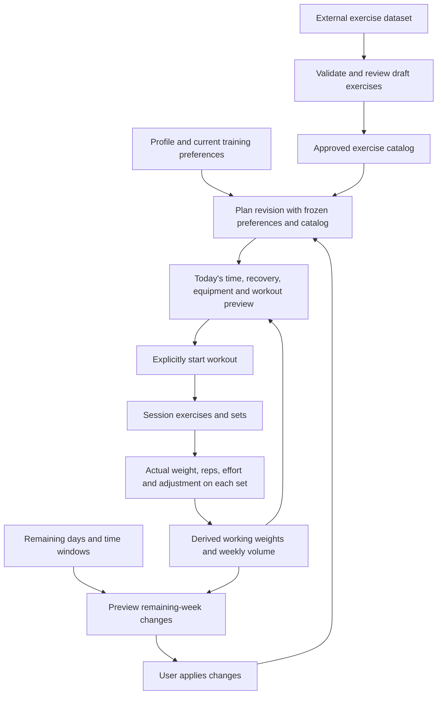

# Fresh training data model

Current routine behavior is documented in [routine-first-implementation.md](routine-first-implementation.md). The seven tables below are unchanged; new routines replace the earlier fixed split and six-week assumptions with an ongoing user-controlled sequence.

This implementation starts fresh. No old users, plans, templates, workouts, or JSON runtime snapshots are migrated. It uses the existing 23 exercises as an initial catalog while an external dataset is selected.

## Data flow

An **exercise** is a catalog lift. A **session** is one workout. A **plan** is a six-week training cycle with recurring workout slots. Internal function names such as `compileBlock` and `solveSession` remain implementation details. People choose their goal and preferences; a workout-template library is not required.

The seed supplies **23 exercise definitions**, not prewritten workouts. Names and videos alone are insufficient for selection: imported exercises need reviewed muscle, equipment, movement, limitation, increment, setup-time and workload metadata. The importer prepares drafts without publishing them.

## Seven tables in the `fitarc` schema

| Table | Purpose |
| --- | --- |
| `fitarc_profiles` | Profile, avatar reference, onboarding values and current training preferences. |
| `fitarc_exercise_catalog` | Shared definitions, stable IDs, provenance, license and draft/approved/retired status. |
| `fitarc_plans` | Immutable plan revisions, stable training-cycle group, start date, frozen preferences/catalog, phases, usual weekly workouts, targets and optional accepted remaining-week forecast. |
| `fitarc_sessions` | Actual proposed/active/completed workouts; references the exact plan revision, or null for future standalone support. |
| `fitarc_session_exercises` | Ordered exercises and historical definition snapshots for a workout. |
| `fitarc_sets` | Prescription and status, optional actual weight/reps/effort/time, and the recommendation/reason/rule version produced by that result. |
| `fitarc_sync_heads` | Per-user revision, mutation receipt, active plan reference and small UI metadata. |

All seven tables and both training RPCs belong to the dedicated **`fitarc` schema**. For example, the profile table is `fitarc.fitarc_profiles`. Existing table names are retained; the schema groups them separately from other applications. The app client sets `db.schema` to `TRAINING_SCHEMA` (`fitarc`), so its table and RPC requests target that namespace. Shared auth and avatar storage retain their own APIs.

There are no separate configuration, result, decision or exercise-state tables. `RuntimeState` still exposes result/decision arrays and working-weight maps to the engine; `trainingState.ts` rebuilds these projections from completed set records. The v3 storage DTO does not save a second mutable copy. Pending and skipped sets contain no fabricated actuals. Undo removes the result and adjustment and restores the following prescription it changed.

Ownership is included in foreign keys. Variable engine artifacts remain JSON within entity rows. One plan revision has a unique UUID; revisions of a cycle share a group UUID and start date. A new cycle receives a new group and date. The current-week cursor may advance without creating another revision. The rest of a saved plan definition is immutable. Sessions retain the exact exercise definitions used, including after catalog changes.

## Remaining-week behavior

In Progress, users choose remaining dates in the current seven-day plan week, time per day, expected recovery and unavailable equipment. The week is anchored to the plan's start date, not automatically Monday. Previewing creates no active workout and writes nothing. Applying an unchanged preview creates a plan revision; intervening training changes require another preview.

The planner counts completed work across revisions, prioritizes muscle groups below the weekly minimum, keeps compatible exercises, and limits prescriptions using time, recovery and each affected muscle's remaining weekly maximum. It reserves forecast set credits across selected days. It explains projected shortfalls instead of doubling missed work. Selecting no days explicitly ends this week's planned work. Forecasts assume completion at the prescribed effort; they are not guaranteed results.

Accepted windows and workout forecasts belong to the plan snapshot, not session rows. Today starts a workout only after an explicit action and recalculates it against current results and the accepted forecast ceilings. A changed condition can shorten it; if no exercise fits, the user can revise the remaining week. The usual schedule resumes next week. The muscle map shows estimated completed and remaining training volume, with exercises/workouts covering the selected group; it does not measure growth or recovery. Native-device and real-user verification remain release work.

## Saves and offline behavior

- The UI applies engine changes immediately. A device queue durably stages each update without waiting for network writes.
- A separate cloud queue calls `fitarc_save_training`. The database locks the user's revision, validates ownership/relationships, and writes the graph in one transaction.
- Stable set IDs prevent duplicate results. Mutation IDs make a retry safe after a response is lost.
- A stale device gets an explicit conflict instead of winning based on its clock. Training remains available locally. Tapping the sync indicator offers **Load cloud version**; before replacement, the device branch is retained under `fitarc:training-runtime:v3:<user-id>:conflict:<id>`.
- Conflicting branches are not merged automatically. Recovery backups can be inspected through device AsyncStorage tooling; there is no in-app backup browser/export yet.
- A pending outbox survives restart and retries on load, on the next edit, or via the sync indicator. First sign-in/profile creation needs connectivity. A previously loaded profile and approved catalog are cached for offline startup. Bundled exercises provide the first catalog fallback.
- New device keys and graph payloads use `v3`. Older v1/v2 keys remain untouched and are not silently interpreted as the new representation. This fresh-start implementation does not migrate old device history.

The transport currently sends the user's complete training graph and reconciles session rows transactionally. This is suitable for the initial small history, but not a claim of incremental sync: large histories should move to paginated reads and operation-based writes. Freezing a large external catalog per plan will also need a versioned catalog-release reference once the catalog size warrants it. Historical records and ownership rules already have separate tables for that evolution.

## Fresh start and deployment

Prepared migrations, in order:

1. `202609240001_fresh_training.sql`: dedicated `fitarc` schema, new tables, ownership policies, atomic read/save RPCs.
2. `202609240002_seed_exercise_catalog.sql`: approved initial 23 exercises with stable IDs matching the bundled catalog.
3. `202609240003_retire_legacy_training.sql`: drops exactly the 25 audited legacy FitArc tables and the two retired RPC names. This is destructive and assumes the explicitly agreed fresh start. It does not use `CASCADE`; unexpected external dependencies stop the cleanup.

Deploy the migrations and the matching app together. Add `fitarc` to the Supabase Data API **Exposed schemas** setting while preserving all existing entries for other applications. The migration grants schema usage and explicit table/function permissions; exposing the schema does not replace RLS. See [Supabase custom schemas](https://supabase.com/docs/guides/api/using-custom-schemas). The old app cannot operate after cleanup. The agent did not modify the hosted database; the user later reported manually creating the tables and restoring login. The hosted migration ledger remains unverified. The old migration version remains as a documented no-op in the active migration directory; its original SQL is archived under `supabase/legacy/`. This intentionally resets the baseline without deleting an already-deployed version from the migration ledger. The archived SQL depended on an older exercise table whose creation was never checked in. The local check tests both the clean active chain and cleanup of a legacy fixture.

This project shares Supabase infrastructure with another app. `auth.users`, other apps' tables, storage objects, and the `avatars` bucket are retained. Existing avatar access policies remain an infrastructure prerequisite. The existing delete-account function still refuses shared-auth deletion; this data-model change does not alter that behavior.

The app now uses `fitarc_profiles` directly. Remove any obsolete `EXPO_PUBLIC_PROFILE_TABLE` override from deployment configuration. Runtime startup no longer queries legacy plans, sessions, templates, or phases; their database services, hooks, and dependent old screens have been removed.

## Catalog import

See [exercise-import.md](exercise-import.md). Approval is an administrative database operation; app users can only read approved catalog entries. The app pages through all approved rows and validates them before caching. Existing plans use their frozen catalog; a newly generated plan uses the latest approved catalog.

Muscle-group highlighting works from exercise metadata. The more detailed anatomical-part annotations remain curated for the original exercise IDs; importing a lift does not fabricate head-specific anatomy claims. Add reviewed part mappings separately where warranted.

## Verification

- `npm run data:check`: actual app-client schema-header routing, shared-storage separation, embedded PostgreSQL migration replay, seed parity, RLS/ownership, atomic rollback, immutable versions, read/write round trip, retry/conflict behavior, undo/discard, offline and delayed-network persistence, external-catalog generation/substitutions, import validation.
- `npm run runtime:check`: deterministic engine contracts.
- `npm run adaptation:check`: missed workout, 35-minute window, unavailable rack, unchanged history, plan revisions, workload caps, acceptance and next-week behavior.
- `npm run typecheck` and `npm run muscle-map:check`.
- `cd landing && npm run preview:check`: bundled preview and artwork parity.

The PostgreSQL harness uses PGlite and stubs Supabase's auth identity function/roles. It skips provisioning the `pgcrypto` extension because its UUID primitive is already available. It does not simulate hosted PostgREST, JWT verification, storage policy configuration, or network infrastructure. A hosted smoke test remains necessary when migrations are deployed.

Deployment handoff and real-user/native checklists: [release-readiness.md](release-readiness.md).

Policy/function design references: [Supabase RLS](https://supabase.com/docs/guides/database/postgres/row-level-security) and [database functions](https://supabase.com/docs/guides/database/functions).
